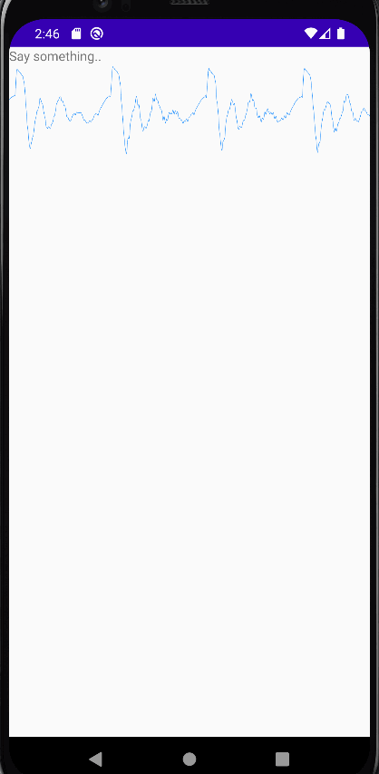

## Microphone audio visualizer for android

captures audio from microphone and visualize it as a waveform

 

check 
[AudioFxDemo.java](app/src/main/java/com/example/apiexploration/AudioFxDemo.java)

Thanks to:
[Roman Nurik](https://github.com/romannurik)  
[source idea](https://android.googlesource.com/platform/development/+/master/samples/ApiDemos/src/com/example/android/apis/media/AudioFxDemo.java)
